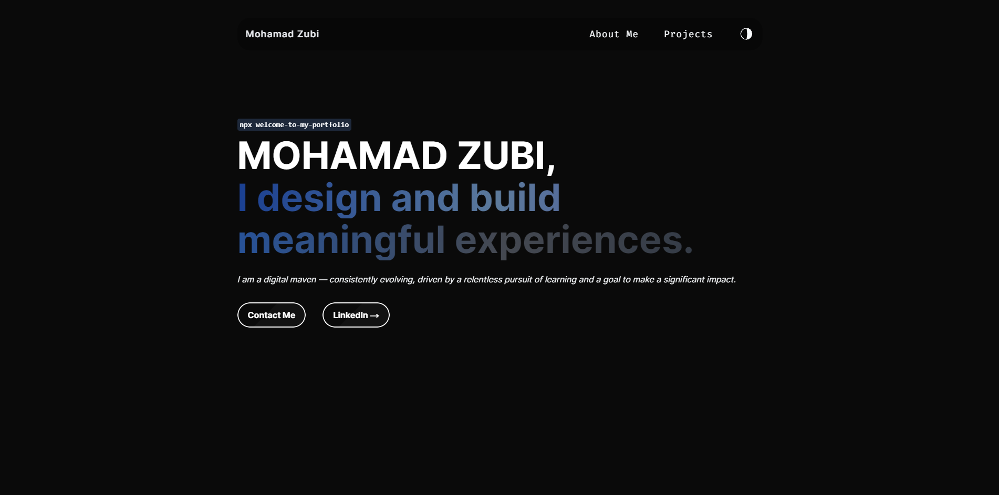
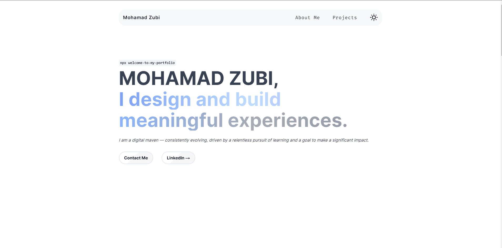
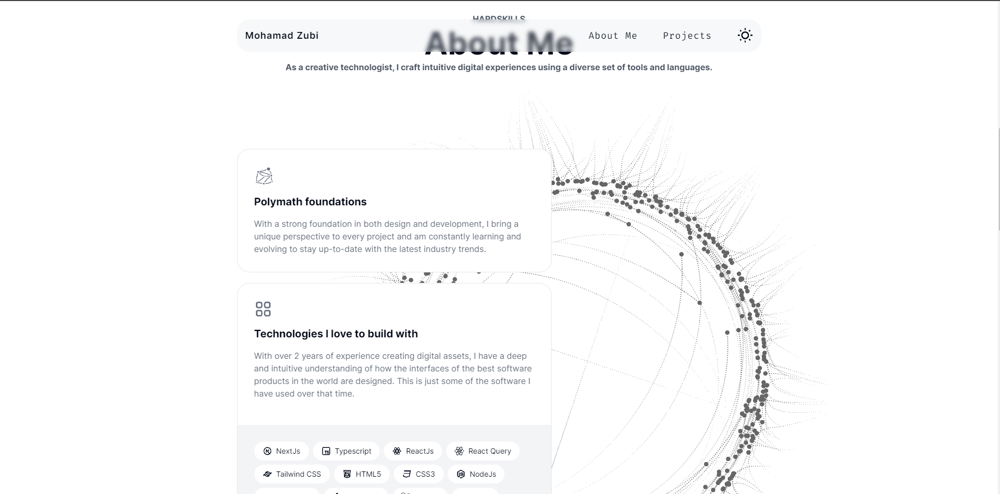
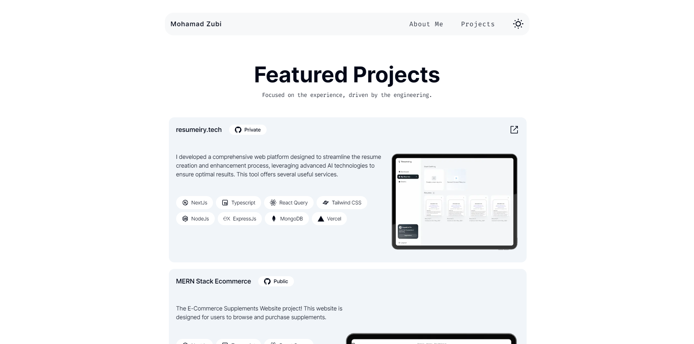
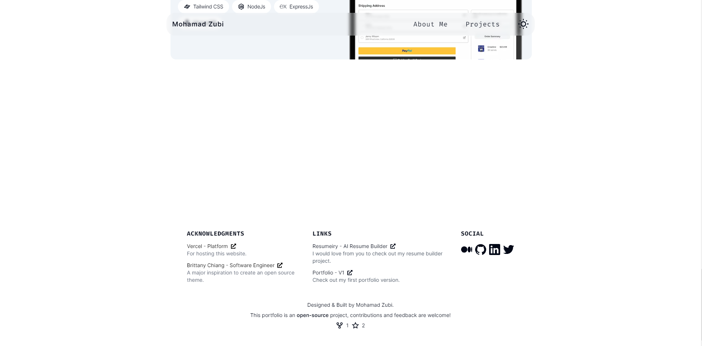
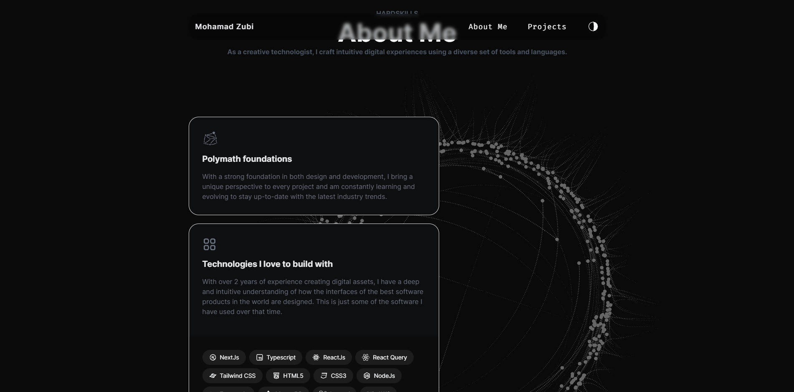
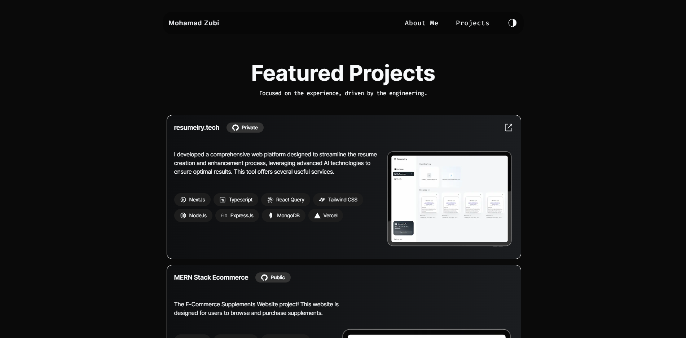
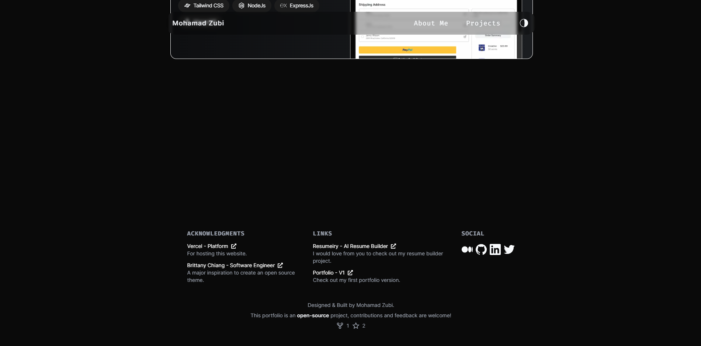

# Portfolio v2


A modern portfolio v2 built with Next.js, TailwindCSS, and Framer Motion, featuring dark and light themes.



## Features

- **Modern Design**: Sleek and contemporary design inspired by Next.js and Vercel.
- **Responsive**: Fully responsive layout suitable for all devices.
- **Two Themes**: Choose between a dark and light theme.
- **Sections**: Includes hero, about, and projects sections.
- **Animations**: Utilizes Framer Motion for smooth animations.

## Demo

Check out the live demo [here]("https://mohamad-zubi.com").

## Installation

To get started, clone the repository and install the dependencies:

```bash
git clone https://github.com/mohamad-zubi/portfolio-v2.git
cd portfolio-v2
npm install
```

## Usage

To run the development server:

```bash
npm run dev
```
Open http://localhost:3000 to view it in your browser.

## Themes
 - Dark
 - Light

## Previews











## Contributing

Contributions are welcome! Please feel free to submit a pull request or open an issue for bugs, feature requests, or questions.

## License
This project is licensed under the MIT License.
